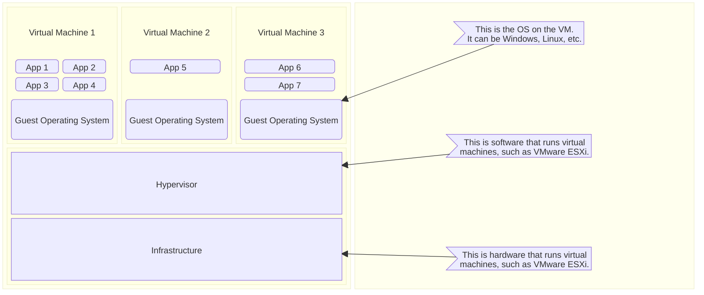

# Crossplane

# Intro to Crossplane
## Brief Intro to Containers and Kubernetes
* In order to understand Crossplane, you first need to understand a few things about Kubernetes.
* And in order to understand Kubernetes, you need to understand a few things about containers.

### Containers
* Containers are lightweight, portable, isolated environments that package an application along with its dependencies, libraries, and configuration files.
* Unlike Virtual Machines, containers share the host Operating System kernel, running in separate user spaces

Virtual Machine

okay

